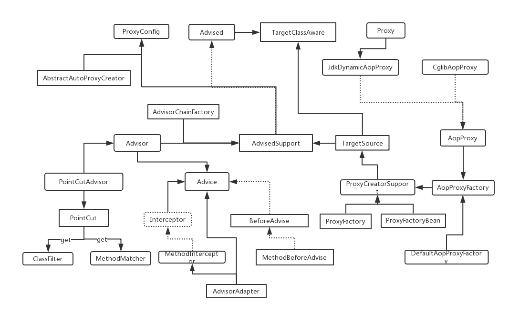

https://blog.csdn.net/zhanglf02/article/details/78132304

## 架构



## AOP(面向切面的编程)使用

是通过划分关注点，来做一些事，这些事在实际编程中与整体业务无关，比如事务控制，日志管理等,通过aop将其与业务代码解耦，以实现精简的业务编码.其整体描述为在什么时候做什么事.

+ 相关的Annotaion:
  - Around  相当于MethodInterceptor
  - Before  相当于BeforeAdvice
  - After    final增强，不管是抛出异常或者正常退出都会执行（总是最后执行）
  - AfterReturning   相当于AfterReturningAdvice，方法正常退出时执行
  - AfterThrowing    相当于ThrowsAdvice，方法异常时执行
  - 执行顺序
+ expression表达式
  - execution
  - args
  - @args()
  - this()
  - target()
  - within()
  - @within()
  - @annotation
+ 处理函数的相关参数
  - ProceedingJoinPoint
  - returning (AfterReturning 可以设置)
  - Exception (AfterThrowing 可以设置)
然后其他的参数，或者target，annotaion之类的，可以通过expression拿到（除了execution）

相比xml配置方式，注解方便还能拿到方法参数
例：@Before("aspect()&&args(id)")

AOP三要素:
* 方面（Aspect）--多个通知和切点的集合，@Aspect作用是把当前类标识为一个切面供容器读取
* 切入点（Pointcut）--在什么地方
* 通知(增强处理)（Advice）--在什么时候干什么事
  * 比如有MethodInterceptor,AfterAdvice,BeforeAdvice等.描述的是在什么时候做一些增强处理

```xml
<bean id="methodAdvice" class="com.earthlyfish.aop.EhcacheAroundAdvice">
    <property name="cache" ref="methodCache"></property>
    </bean>

    <!-- 配置切点,通知 -->
    <aop:config>
        <aop:pointcut
            expression="(execution(public * com.earthlyfish.service..get*(..))) or (execution(public * com.earthlyfish.service..find*(..)))"
            id="methodCachePoint" />
        <aop:advisor advice-ref="methodAdvice" pointcut-ref="methodCachePoint" />
    </aop:config>
```
<aop:pointcut>：用来定义切入点，该切入点可以重用
<aop:advisor>:用来定义只有一个通知和一个切入点的切面
<aop:aspect>：用来定义切面，该切面可以包含多个切入点和通知，而且标签内部的通知和切入点定义是无序的；和advisor的区别就在此，advisor只包含一个通知和一个切入点


##　事务管理
Spring通过TransactionManager来实现事务管理，现有两种方式，一种是通过aop注入式的方式实现，另一种是通过@Transactional在方法上实现事务管理.
### aop注入式
```xml
    <bean id="txManager"
    class="org.springframework.jdbc.datasource.DataSourceTransactionManager">
        <property name="dataSource" ref="dataSource" />
    </bean>

    <tx:advice id="txAdvice" transaction-manager="txManager">
        <tx:attributes>
            <tx:method name="query*" read-only="true" propagation="REQUIRED" />
            <tx:method name="get*" read-only="true" propagation="REQUIRED" />
            <tx:method name="create*" propagation="REQUIRED"
                rollback-for="java.lang.Exception,java.lang.RuntimeException" />
            <tx:method name="add*" propagation="REQUIRED"
                rollback-for="java.lang.Exception,java.lang.RuntimeException" />
            <tx:method name="save*" propagation="REQUIRED"
                rollback-for="java.lang.Exception,java.lang.RuntimeException" />
            <tx:method name="update*" propagation="REQUIRED"
                rollback-for="java.lang.Exception,java.lang.RuntimeException" />
            <tx:method name="delete*" propagation="REQUIRED"
                rollback-for="java.lang.Exception,java.lang.RuntimeException" />
            <tx:method name="remove*" propagation="REQUIRED"
                rollback-for="java.lang.Exception,java.lang.RuntimeException" />
            <tx:method name="*" propagation="REQUIRED" />
        </tx:attributes>
    </tx:advice>

    <aop:config>
        <!--切入点指明了在所有方法产生事务拦截操作  -->
        <aop:pointcut id="module-pointcut"
            expression="execution(* com.wyp.module.service.*.*(..))" />
        <!--定义了将采用何种拦截操作，这里引用到 txAdvice,即在什么时候做什么事  -->
        <aop:advisor advice-ref="txAdvice" pointcut-ref="module-pointcut" />
    </aop:config>
```

### @Transactional  

需要在配置文件中有tx相关的注解.
```
<!-- 此注解表示声明式事务，在方法上通过@Transactional控制事务 -->
    <tx:annotation-driven transaction-manager="txManager" />
```
在需要的地方通过@Transactional注入:

@Transactional(propagation=Propagation.REQUIRED)
​    public UserType registerUser(Customer customer) {
对于这种方式，如果一个类里面有两个方法A和B，A方法调用了B方法，如果调用A方法的话,整个事务运用会有下面三种情况：

1. A上加了注解，B上不加，则整体会受事务控制.
2. A上加了注解，B上加，则整体会受事务控制.其实这里调用和1一样，在AOP代理时只给A方法加了环绕事务通知.
3. A上不加注解，B上加，则整体不受事务控制.这是因为调用A方法时由于没有判断到事务注解的存在，因此代理类没有声称事务控制的字节码，这直接使用的被代理类的字节码，所以不受事务控制.

### 编码式

编码式通过在代码中加入事务管理来达到目的，但由于事务逻辑与主业务逻辑没啥关系，代码没必要紧耦合在一起，所以此方法不怎么使用.

## AOP相关概念
* 切面（Aspect）：（有共同点的类），\<aop:aspect\>配置或@Aspect
* 连接点（Jointpoint）：规定切面中方法调用的一些规则（方法共同点），持有当前，对象引用、方法
* 通知（Advice）："切面"对于某个"连接点"所产生的动作，满足连接点规则就触发通知。
  * 通知类型：前置、后置、环绕、回滚、异常
* 切入点（Pointcut）：（某一具体bean的某一具体方法），（AOP独有方法拦截器）包名->类名->方法名
* 目标对象（Target Object）
* AOP 代理（AOP Proxy）

事件机制，先注册后调用

```
类似java方法定义格式， 如果方法被final修饰，不能用cglib代理，因为方法无法重写，

execution(modifiers-pattern?  ret-type-pattern  declaring-type-pattern?name-pattern(param-pattern) throws-pattern?)    带？为可选

modifiers-pattern 方法操作权限
ret-type-pattern  返回值
declaring-type-pattern 方法所在的包
name-pattern 方法名
param-pattern 参数名
throws-pattern 异常

 权限修饰符(public/private/protected) 返回值(Void/自定义类型) 哪个包.哪个类.方法名称(参数列表) throws 异常类型
 例：借鉴URL语法  cd(change dirtory) .(当前目录)
 execution(public void/* com.xxx.mypackage.mybean.mymethod(..))

 参数列表的不同跟什么有关系？
 1. 参数的个数
 2. 参数的顺序
 3. 参数的类型

 跟参数的名字没有任何关系，形式参数  
 .. 任意

 
```
目标对象，AOP代理。
访问当前连接点JoinPoint？？？用法

切面大规则，连接点（开始前点、结束后点...）是详细规则

chain
### AOP用途
```
Authenticaton  权限
Caching  缓存(before判断，after return存储)
Debugging 调试
Logging 日志
Transaction Manager 事务
Monitor 监听
Inteceptor 拦截
Context Passing 内容传递
```


做事务代理的时候

TransactionManager 来管理事务操作（切面）

DataSource，SessionFactory(DataSource)

DataSource 包含了连接信息，事务的提交或者回滚一些基础功能

通过连接点可以获取到方法（切点）具体操作哪个 DataSource

通过切面通知类型，去执行 DataSource 的功能方法 


## 其他

### LTW（Load Time Weaving）

除了运行时织入切面的方式外，我们还有一种途径进行切面织入，它可以在**类加载期通过字节码转换**，进而将目标织入切入点（目标类），这种方式就是LTW，即**静态代理**（静待代理也被称作**编译时增强**，后面会有相关代码样例）。

**java.lang.instrument（since JDK5.0）包的工作原理**

目的就是为了能对JVM底层组件进行访问。

通过JVM的启动参数**-javaagent**在启动时获取JVM内部组件的引用。参数格式如下：

> -javaagent:<jarpath>[=options]

它在JVM启动时会装配并应用ClassTransformer，对类字节码进行转换，进而实现AOP的功能

**ClassFileTransformer**

注意：transform方法会有一个返回值，类型是byte[]，表示转换后的字节码，但是如果返回为空，则表示不进行节码转换处理，千万不要当作是把原先类的字节码清空。

paramString 可视作 className

- **Instrumentation**

这个接口提供了很多方法，我们主要注意一个方法即可，即：addTransformer方法，它的作用就是把一些ClassFileTransformer注册到JVM内部，接口如图所示：

自定义代理类：

public static void premain(String args,Instrumentation instrumentation )

**具体工作原理是这样的：**

① ClassFileTransformer实例注册到JVM之后，JVM在加载Class文件时，就会先调用ClassFileTransformer的transform()方法进行字节码转换；

② 若注册了多个ClassFileTransformer实例，则按照注册时的顺序进行一次调用。

这样也就实现了从JVM层面截获字节码，进而织入操作者自己希望添加的逻辑，即实现AOP效果。

#  AOP流程底层源码

proxyFactoryBean

## AopProxyFactory

入口 getProxy()

**独立的工厂体系（跟IOC流程不同）**
依赖于IOC容器，等IOC容器启动以后，进行二次操作
拿到IOC容器引用，从IOC容器取二次操作所有对象（代理类）   
AOP 对代理类的二次操作深操作

**若有实现接口，默认使用JDK代理**
AOP -> 默认JDK，IOC -> 默认cglib


利用 IOC 中的后置处理器 BeanPostProcessor  
方法拦截器（AOP独有）

 1. 注册逻辑  
<aop:aspectj-autoproxy proxy-target-class="true"/>
```java
AopNamespaceHandler 会解析aspectj-autoproxy
registerBeanDefinitionParser("aspectj-autoproxy", new AspectJAutoProxyBeanDefinitionParser());
  =》
AspectJAutoProxyBeanDefinitionParser 会调用
AopNamespaceUtils.registerAspectJAnnotationAutoProxyCreatorIfNecessary(parserContext, element);
  =》
最后会注册一个AnnotationAwareAspectJAutoProxyCreator， 这个就是
return registerOrEscalateApcAsRequired(AnnotationAwareAspectJAutoProxyCreator.class, registry, source);
  =》
注入proxy-target-class (默认false，true的化，直接走cglib动态代理，不走jdk)
注入expose-proxy 
解决 自己调用自己不能被spring监控的问题
设为true之后，可以使用 (MyService)(AopContext.currentProxy()).doAnotherFunction()
```

2. 加强的时机
加强逻辑在AbstractAutoProxyCreator中
proxy逻辑在是在 wrapIfNecessary(bean, beanName, cacheKey);
可以看到加强的地方
* 循环依赖的处理
```java
//循环依赖的处理
SmartInstantiationAwareBeanPostProcessor.getEarlyBeanReference
InstantiationAwareBeanPostProcessor.postProcessBeforeInstantiation

主要逻辑在AbstractAutoProxyCreator中
实现了getEarlyBeanReference,会在这里直接返回一个代理类  
然后放到 earlyProxyReferences, 标记这个 bean 已经被 early 处理过了  
然后在 postProcessAfterInitialization，会判定如果在 early 处理过了，就不需要在进行代理了


spring在初始化完之后，会check一遍
如果有循环依赖，即有early对象了

而且bean没有在beanPostProcessor被替换掉，那么就返回early对象到容器里
然后被修改过了，就会抛错处理
```

3. 具体加强的判断
主要在wrapIfNecessary中
* 判断是否需要代理  
  过滤Advice等不需要代理的类
* 获取所有可以适用于这个类的Advice
* 根据advice生成代理类  
```java
// 判断是否这个bean需要被代理
// isInfrastructureClass 如果是基础类，就不需要被代理 Advice， Advisor, AopInfrastructureBean, 或者实现了@Aspect
// shouldSkip 这里处理配置 Advice配置的 aspectName
if (isInfrastructureClass(bean.getClass()) || shouldSkip(bean.getClass(), beanName)) {
    this.advisedBeans.put(cacheKey, Boolean.FALSE);
    return bean;
}
// 获取所以可以适用于这个类的 Advice
Object[] specificInterceptors = getAdvicesAndAdvisorsForBean(bean.getClass(), beanName, null);

// 这里创建代理类，生成代理
Object proxy = createProxy(bean.getClass(), beanName, specificInterceptors, new SingletonTargetSource(bean));
```


###  JdkDynamicAopProxy
实现了InvocationHandler
```java
//获取适用的advices
List<Object> chain = this.advised.getInterceptorsAndDynamicInterceptionAdvice(method, targetClass);
//然后生成ReflectiveMethodInvocation执行
invocation = new ReflectiveMethodInvocation(proxy, target, method, args, targetClass, chain);
retVal = invocation.proceed();
```

this.advised.getInterceptorsAndDynamicInterceptionAdvice(method, targetClass);

实际调用 DefaultAdvisorChainFactory 的getInterceptorsAndDynamicInterceptionAdvice

切点实际是Method  
切点，转换为 MethodInterceptor，保存到一个为链表结构、有顺序容器里，，知道它上一个是谁，它的下一个是谁  
AOP做权限控制受益于拦截器链表设计
```java
public List<Object> getInterceptorsAndDynamicInterceptionAdvice(
        Advised config, Method method, Class targetClass) {

    // This is somewhat tricky... we have to process introductions first,
    // but we need to preserve order in the ultimate list.
    List<Object> interceptorList = new ArrayList<Object>(config.getAdvisors().length);
    // 查看是否包含 IntroductionAdvisor
    boolean hasIntroductions = hasMatchingIntroductions(config, targetClass);
    // 这里实际上注册一系列 AdvisorAdapter，用于将Advisor 转化成 MethodInterceptor
    AdvisorAdapterRegistry registry = GlobalAdvisorAdapterRegistry.getInstance();
    for (Advisor advisor : config.getAdvisors()) {
        if (advisor instanceof PointcutAdvisor) {
            // Add it conditionally.
            PointcutAdvisor pointcutAdvisor = (PointcutAdvisor) advisor;
            if (config.isPreFiltered() || pointcutAdvisor.getPointcut().getClassFilter().matches(targetClass)) {
                // 两个方法位置可以互换
                // 将 Advisor 转化成 MethodInterceptor
                MethodInterceptor[] interceptors = registry.getInterceptors(advisor);
                // 检查当前 Advisor 的 pointcut 是否可以匹配当前方法
                MethodMatcher mm = pointcutAdvisor.getPointcut().getMethodMatcher();
                if (MethodMatchers.matches(mm, method, targetClass, hasIntroductions)) {
                    if (mm.isRuntime()) {
                        // Creating a new object instance in the getInterceptors() method
                        // isn't a problem as we normally cache created chains.
                        for (MethodInterceptor interceptor : interceptors) {
                            interceptorList.add(new InterceptorAndDynamicMethodMatcher(interceptor, mm));
                        }
                    }
                    else {
                        interceptorList.addAll(Arrays.asList(interceptors));
                    }
                }
            }
        }
        else if (advisor instanceof IntroductionAdvisor) {
            IntroductionAdvisor ia = (IntroductionAdvisor) advisor;
            if (config.isPreFiltered() || ia.getClassFilter().matches(targetClass)) {
                Interceptor[] interceptors = registry.getInterceptors(advisor);
                interceptorList.addAll(Arrays.asList(interceptors));
            }
        }
        else {
            Interceptor[] interceptors = registry.getInterceptors(advisor);
            interceptorList.addAll(Arrays.asList(interceptors));
        }
    }
    return interceptorList;
}
```
AopConfig
#### 拦截器链怎么发挥作用？
```java
// JdkDynamicAopProxy
// 如果没有可以应用到此方法的通知（Interceptor），此直接反射调用 method.invoke(target, args)
if (chain.isEmpty()) {
    // We can skip creating a MethodInvocation: just invoke the target directly
    // Note that the final invoker must be an InvokerInterceptor so we know it does
    // nothing but a reflective operation on the target, and no hot swapping or fancy proxying.
    retVal = AopUtils.invokeJoinpointUsingReflection(target, method, args);
}
else {
    // We need to create a method invocation...
    invocation = new ReflectiveMethodInvocation(proxy, target, method, args, targetClass, chain);
    // Proceed to the joinpoint through the interceptor chain. 
    retVal = invocation.proceed();// 关注
}
```
#### ReflectiveMethodInvocation#proceed();

#### 小结
```
before     open事务
throwing   rollback事务
after      commit事务

1. 加载配置信息，解析成AspectConfig
2. 交给AopProxyFactory，调用creatAopProxy
3. JdkDynamicAopProxy 调用 AdvisedSupport 的 getInterceptorsAndDynamicInterceptionAdvice 方法得到方法拦截器链，并保存到一个容器List  MethodInterceptor
4. 递归执行拦截器方法proceed()
5. 由一个Adivisor执行切面中的方法

@ContextConfiguration(locations = "")
```
##### ObjenesisCglibAopProxy

生成对应的callbacks（MethodInterceptor），设置到Enhancer里
```java
protected Object createProxyClassAndInstance(Enhancer enhancer, Callback[] callbacks) {
    enhancer.setInterceptDuringConstruction(false);
    enhancer.setCallbacks(callbacks);
    return (this.constructorArgs != null ?
            enhancer.create(this.constructorArgTypes, this.constructorArgs) :
            enhancer.create());
}
```
 Enhancer允许为非接口类型创建一个Java代理。Enhancer动态创建了给定类型的子类但是拦截了所有的方法。