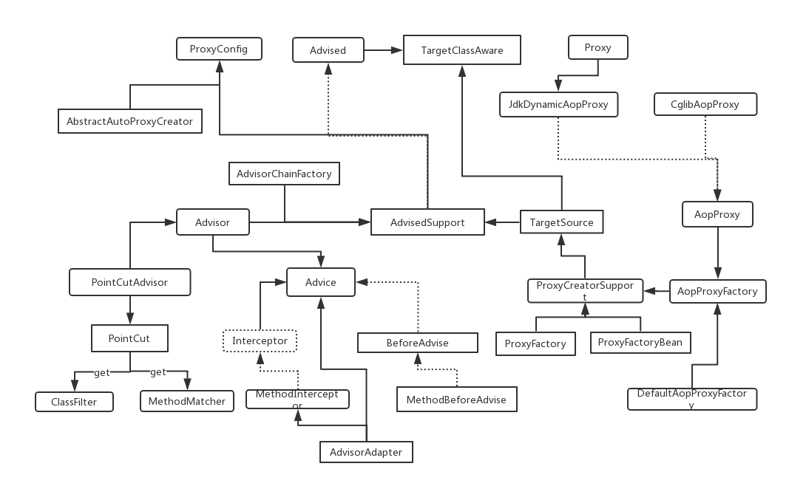

https://blog.csdn.net/zhanglf02/article/details/78132304

## 架构



## AOP(面向切面的编程)使用

是通过划分关注点，来做一些事，这些事在实际编程中与整体业务无关，比如事务控制，日志管理等,通过aop将其与业务代码解耦，以实现精简的业务编码.其整体描述为在什么时候做什么事.

+ 相关的Annotaion:
  - Around  相当于MethodInterceptor
  - Before  相当于BeforeAdvice
  - After    final增强，不管是抛出异常或者正常退出都会执行（总是最后执行）
  - AfterReturning   相当于AfterReturningAdvice，方法正常退出时执行
  - AfterThrowing    相当于ThrowsAdvice，方法异常时执行
  - 执行顺序
+ expression表达式
  - execution
  - args
  - @args()
  - this()
  - target()
  - within()
  - @within()
  - @annotation
+ 处理函数的相关参数
  - ProceedingJoinPoint
  - returning (AfterReturning 可以设置)
  - Exception (AfterThrowing 可以设置)
然后其他的参数，或者target，annotaion之类的，可以通过expression拿到（除了execution）

相比xml配置方式，注解方便还能拿到方法参数
例：@Before("aspect()&&args(id)")

AOP三要素:
* 方面（Aspect）--多个通知和切点的集合，@Aspect作用是把当前类标识为一个切面供容器读取
* 切入点（Pointcut）--在什么地方
* 通知(增强处理)（Advice）--在什么时候干什么事
  * 比如有MethodInterceptor,AfterAdvice,BeforeAdvice等.描述的是在什么时候做一些增强处理

```xml
<bean id="methodAdvice" class="com.earthlyfish.aop.EhcacheAroundAdvice">
    <property name="cache" ref="methodCache"></property>
    </bean>

    <!-- 配置切点,通知 -->
    <aop:config>
        <aop:pointcut
            expression="(execution(public * com.earthlyfish.service..get*(..))) or (execution(public * com.earthlyfish.service..find*(..)))"
            id="methodCachePoint" />
        <aop:advisor advice-ref="methodAdvice" pointcut-ref="methodCachePoint" />
    </aop:config>
```
\<aop:pointcut>：用来定义切入点，该切入点可以重用
<\aop:advisor>:用来定义只有一个通知和一个切入点的切面
<\aop:aspect>：用来定义切面，该切面可以包含多个切入点和通知，而且标签内部的通知和切入点定义是无序的；和advisor的区别就在此，advisor只包含一个通知和一个切入点

##　事务管理

Spring通过TransactionManager来实现事务管理，现有两种方式，一种是通过aop注入式的方式实现，另一种是通过@Transactional在方法上实现事务管理.
### aop注入式
```xml
    <bean id="txManager"
    class="org.springframework.jdbc.datasource.DataSourceTransactionManager">
        <property name="dataSource" ref="dataSource" />
    </bean>

    <tx:advice id="txAdvice" transaction-manager="txManager">
        <tx:attributes>
            <tx:method name="query*" read-only="true" propagation="REQUIRED" />
            <tx:method name="get*" read-only="true" propagation="REQUIRED" />
            <tx:method name="create*" propagation="REQUIRED"
                rollback-for="java.lang.Exception,java.lang.RuntimeException" />
            <tx:method name="add*" propagation="REQUIRED"
                rollback-for="java.lang.Exception,java.lang.RuntimeException" />
            <tx:method name="save*" propagation="REQUIRED"
                rollback-for="java.lang.Exception,java.lang.RuntimeException" />
            <tx:method name="update*" propagation="REQUIRED"
                rollback-for="java.lang.Exception,java.lang.RuntimeException" />
            <tx:method name="delete*" propagation="REQUIRED"
                rollback-for="java.lang.Exception,java.lang.RuntimeException" />
            <tx:method name="remove*" propagation="REQUIRED"
                rollback-for="java.lang.Exception,java.lang.RuntimeException" />
            <tx:method name="*" propagation="REQUIRED" />
        </tx:attributes>
    </tx:advice>

    <aop:config>
        <!--切入点指明了在所有方法产生事务拦截操作  -->
        <aop:pointcut id="module-pointcut"
            expression="execution(* com.wyp.module.service.*.*(..))" />
        <!--定义了将采用何种拦截操作，这里引用到 txAdvice,即在什么时候做什么事  -->
        <aop:advisor advice-ref="txAdvice" pointcut-ref="module-pointcut" />
    </aop:config>
```

### @Transactional  

需要在配置文件中有tx相关的注解.
```
<!-- 此注解表示声明式事务，在方法上通过@Transactional控制事务 -->
    <tx:annotation-driven transaction-manager="txManager" />
```
在需要的地方通过@Transactional注入:

@Transactional(propagation=Propagation.REQUIRED)
​    public UserType registerUser(Customer customer) {
对于这种方式，如果一个类里面有两个方法A和B，A方法调用了B方法，如果调用A方法的话,整个事务运用会有下面三种情况：

1. A上加了注解，B上不加，则整体会受事务控制.
2. A上加了注解，B上加，则整体会受事务控制.其实这里调用和1一样，在AOP代理时只给A方法加了环绕事务通知.
3. A上不加注解，B上加，则整体不受事务控制.这是因为调用A方法时由于没有判断到事务注解的存在，因此代理类没有声称事务控制的字节码，这直接使用的被代理类的字节码，所以不受事务控制.

### 编码式

编码式通过在代码中加入事务管理来达到目的，但由于事务逻辑与主业务逻辑没啥关系，代码没必要紧耦合在一起，所以此方法不怎么使用.

## AOP相关概念
* 切面（Aspect）：（有共同点的类），\<aop:aspect\>配置或@Aspect
* 连接点（Jointpoint）：规定切面中方法调用的一些规则（方法共同点），持有当前，对象引用、方法
* 通知（Advice）："切面"对于某个"连接点"所产生的动作，满足连接点规则就触发通知。
  * 通知类型：前置、后置、环绕、回滚、异常
* 切入点（Pointcut）：（某一具体bean的某一具体方法），（AOP独有方法拦截器）包名->类名->方法名
* 目标对象（Target Object）
* AOP 代理（AOP Proxy）

事件机制，先注册后调用

```
类似java方法定义格式， 如果方法被final修饰，不能用cglib代理，因为方法无法重写，

execution(modifiers-pattern?  ret-type-pattern  declaring-type-pattern?name-pattern(param-pattern) throws-pattern?)    带？为可选

modifiers-pattern 方法操作权限
ret-type-pattern  返回值
declaring-type-pattern 方法所在的包
name-pattern 方法名
param-pattern 参数名
throws-pattern 异常

 权限修饰符(public/private/protected) 返回值(Void/自定义类型) 哪个包.哪个类.方法名称(参数列表) throws 异常类型
 例：借鉴URL语法  cd(change dirtory) .(当前目录)
 execution(public void/* com.xxx.mypackage.mybean.mymethod(..))

 参数列表的不同跟什么有关系？
 1. 参数的个数
 2. 参数的顺序
 3. 参数的类型

 跟参数的名字没有任何关系，形式参数  
 .. 任意

 
```
目标对象，AOP代理。
访问当前连接点JoinPoint？？？用法

切面大规则，连接点（开始前点、结束后点...）是详细规则

chain
### AOP用途
```
Authenticaton  权限
Caching  缓存(before判断，after return存储)
Debugging 调试
Logging 日志
Transaction Manager 事务
Monitor 监听
Inteceptor 拦截
Context Passing 内容传递
```


做事务代理的时候

TransactionManager 来管理事务操作（切面）

DataSource，SessionFactory(DataSource)

DataSource 包含了连接信息，事务的提交或者回滚一些基础功能

通过连接点可以获取到方法（切点）具体操作哪个 DataSource

通过切面通知类型，去执行 DataSource 的功能方法 


## 其他

### LTW（Load Time Weaving）

除了运行时织入切面的方式外，我们还有一种途径进行切面织入，它可以在**类加载期通过字节码转换**，进而将目标织入切入点（目标类），这种方式就是LTW，即**静态代理**（静待代理也被称作**编译时增强**，后面会有相关代码样例）。

**java.lang.instrument（since JDK5.0）包的工作原理**

目的就是为了能对JVM底层组件进行访问。

通过JVM的启动参数**-javaagent**在启动时获取JVM内部组件的引用。参数格式如下：

> -javaagent:<jarpath>[=options]

它在JVM启动时会装配并应用ClassTransformer，对类字节码进行转换，进而实现AOP的功能

**ClassFileTransformer**

注意：transform方法会有一个返回值，类型是byte[]，表示转换后的字节码，但是如果返回为空，则表示不进行节码转换处理，千万不要当作是把原先类的字节码清空。

paramString 可视作 className

- **Instrumentation**

这个接口提供了很多方法，我们主要注意一个方法即可，即：addTransformer方法，它的作用就是把一些ClassFileTransformer注册到JVM内部，接口如图所示：

自定义代理类：

public static void premain(String args,Instrumentation instrumentation )

**具体工作原理是这样的：**

① ClassFileTransformer实例注册到JVM之后，JVM在加载Class文件时，就会先调用ClassFileTransformer的transform()方法进行字节码转换；

② 若注册了多个ClassFileTransformer实例，则按照注册时的顺序进行一次调用。

这样也就实现了从JVM层面截获字节码，进而织入操作者自己希望添加的逻辑，即实现AOP效果。

#  AOP流程底层源码

proxyFactoryBean

## AopProxyFactory

入口 getProxy()

**独立的工厂体系（跟IOC流程不同）**
依赖于IOC容器，等IOC容器启动以后，进行二次操作
拿到IOC容器引用，从IOC容器取二次操作所有对象（代理类）   
AOP 对代理类的二次操作深操作

**若有实现接口，默认使用JDK代理**
AOP -> 默认JDK，IOC -> 默认cglib


利用 IOC 中的后置处理器 BeanPostProcessor  
方法拦截器（AOP独有）

 1. 注册逻辑  
<aop:aspectj-autoproxy proxy-target-class="true"/>
```java
AopNamespaceHandler 会解析aspectj-autoproxy
registerBeanDefinitionParser("aspectj-autoproxy", new AspectJAutoProxyBeanDefinitionParser());
  =》
AspectJAutoProxyBeanDefinitionParser 会调用
AopNamespaceUtils.registerAspectJAnnotationAutoProxyCreatorIfNecessary(parserContext, element);
  =》
最后会注册一个AnnotationAwareAspectJAutoProxyCreator， 这个就是
return registerOrEscalateApcAsRequired(AnnotationAwareAspectJAutoProxyCreator.class, registry, source);
  =》
注入proxy-target-class (默认false，true的化，直接走cglib动态代理，不走jdk)
注入expose-proxy 
解决 自己调用自己不能被spring监控的问题
设为true之后，可以使用 (MyService)(AopContext.currentProxy()).doAnotherFunction()
```

2. 加强的时机
加强逻辑在AbstractAutoProxyCreator中
proxy逻辑在是在 wrapIfNecessary(bean, beanName, cacheKey);
可以看到加强的地方
3. 具体加强的判断
主要在wrapIfNecessary中
* 判断是否需要代理  
  过滤Advice等不需要代理的类
* 获取所有可以适用于这个类的Advice
* 根据advice生成代理类  
```java
// 判断是否这个bean需要被代理
// isInfrastructureClass 如果是基础类，就不需要被代理 Advice， Advisor, AopInfrastructureBean, 或者实现了@Aspect
// shouldSkip 这里处理配置 Advice配置的 aspectName
if (isInfrastructureClass(bean.getClass()) || shouldSkip(bean.getClass(), beanName)) {
    this.advisedBeans.put(cacheKey, Boolean.FALSE);
    return bean;
}
// 获取所以可以适用于这个类的 Advice
Object[] specificInterceptors = getAdvicesAndAdvisorsForBean(bean.getClass(), beanName, null);

// 这里创建代理类，生成代理
Object proxy = createProxy(bean.getClass(), beanName, specificInterceptors, new SingletonTargetSource(bean));
```


###  JdkDynamicAopProxy
实现了InvocationHandler
```java
//获取适用的advices
List<Object> chain = this.advised.getInterceptorsAndDynamicInterceptionAdvice(method, targetClass);
//然后生成ReflectiveMethodInvocation执行
invocation = new ReflectiveMethodInvocation(proxy, target, method, args, targetClass, chain);
retVal = invocation.proceed();
```

this.advised.getInterceptorsAndDynamicInterceptionAdvice(method, targetClass);

实际调用 DefaultAdvisorChainFactory 的getInterceptorsAndDynamicInterceptionAdvice

切点实际是Method  
切点，转换为 MethodInterceptor，保存到一个为链表结构、有顺序容器里，，知道它上一个是谁，它的下一个是谁  
AOP做权限控制受益于拦截器链表设计
```java
public List<Object> getInterceptorsAndDynamicInterceptionAdvice(
        Advised config, Method method, Class targetClass) {

    // This is somewhat tricky... we have to process introductions first,
    // but we need to preserve order in the ultimate list.
    List<Object> interceptorList = new ArrayList<Object>(config.getAdvisors().length);
    // 查看是否包含 IntroductionAdvisor
    boolean hasIntroductions = hasMatchingIntroductions(config, targetClass);
    // 这里实际上注册一系列 AdvisorAdapter，用于将Advisor 转化成 MethodInterceptor
    AdvisorAdapterRegistry registry = GlobalAdvisorAdapterRegistry.getInstance();
    for (Advisor advisor : config.getAdvisors()) {
        if (advisor instanceof PointcutAdvisor) {
            // Add it conditionally.
            PointcutAdvisor pointcutAdvisor = (PointcutAdvisor) advisor;
            if (config.isPreFiltered() || pointcutAdvisor.getPointcut().getClassFilter().matches(targetClass)) {
                // 两个方法位置可以互换
                // 将 Advisor 转化成 MethodInterceptor
                MethodInterceptor[] interceptors = registry.getInterceptors(advisor);
                // 检查当前 Advisor 的 pointcut 是否可以匹配当前方法
                MethodMatcher mm = pointcutAdvisor.getPointcut().getMethodMatcher();
                if (MethodMatchers.matches(mm, method, targetClass, hasIntroductions)) {
                    if (mm.isRuntime()) {
                        // Creating a new object instance in the getInterceptors() method
                        // isn't a problem as we normally cache created chains.
                        for (MethodInterceptor interceptor : interceptors) {
                            interceptorList.add(new InterceptorAndDynamicMethodMatcher(interceptor, mm));
                        }
                    }
                    else {
                        interceptorList.addAll(Arrays.asList(interceptors));
                    }
                }
            }
        }
        else if (advisor instanceof IntroductionAdvisor) {
            IntroductionAdvisor ia = (IntroductionAdvisor) advisor;
            if (config.isPreFiltered() || ia.getClassFilter().matches(targetClass)) {
                Interceptor[] interceptors = registry.getInterceptors(advisor);
                interceptorList.addAll(Arrays.asList(interceptors));
            }
        }
        else {
            Interceptor[] interceptors = registry.getInterceptors(advisor);
            interceptorList.addAll(Arrays.asList(interceptors));
        }
    }
    return interceptorList;
}
```
AopConfig
#### 拦截器链怎么发挥作用？
```java
// JdkDynamicAopProxy
// 如果没有可以应用到此方法的通知（Interceptor），此直接反射调用 method.invoke(target, args)
if (chain.isEmpty()) {
    // We can skip creating a MethodInvocation: just invoke the target directly
    // Note that the final invoker must be an InvokerInterceptor so we know it does
    // nothing but a reflective operation on the target, and no hot swapping or fancy proxying.
    retVal = AopUtils.invokeJoinpointUsingReflection(target, method, args);
}
else {
    // We need to create a method invocation...
    invocation = new ReflectiveMethodInvocation(proxy, target, method, args, targetClass, chain);
    // Proceed to the joinpoint through the interceptor chain. 
    retVal = invocation.proceed();// 关注
}
```
#### ReflectiveMethodInvocation#proceed();

#### 小结
```
before     open事务
throwing   rollback事务
after      commit事务

1. 加载配置信息，解析成AspectConfig
2. 交给AopProxyFactory，调用creatAopProxy
3. JdkDynamicAopProxy 调用 AdvisedSupport 的 getInterceptorsAndDynamicInterceptionAdvice 方法得到方法拦截器链，并保存到一个容器List  MethodInterceptor
4. 递归执行拦截器方法proceed()
5. 由一个Adivisor执行切面中的方法

@ContextConfiguration(locations = "")
```
##### ObjenesisCglibAopProxy

生成对应的callbacks（MethodInterceptor），设置到Enhancer里
```java
protected Object createProxyClassAndInstance(Enhancer enhancer, Callback[] callbacks) {
    enhancer.setInterceptDuringConstruction(false);
    enhancer.setCallbacks(callbacks);
    return (this.constructorArgs != null ?
            enhancer.create(this.constructorArgTypes, this.constructorArgs) :
            enhancer.create());
}
```
 Enhancer允许为非接口类型创建一个Java代理。Enhancer动态创建了给定类型的子类但是拦截了所有的方法。


**本文主要介绍spring aop中9种切入点表达式的写法**

1. **execute**
2. **within**
3. **this**
4. **target**
5. **args**
6. **@target**
7. **@within**
8. **@annotation**
9. @args

## 1.execute表达式

### 拦截任意公共方法

```
execution(public * *(..))
```

### 拦截以set开头的任意方法

```
execution(* set*(..))
```

### 拦截类或者接口中的方法

```
execution(* com.xyz.service.AccountService.*(..))
```

> 拦截**AccountService**(类、接口)中定义的所有方法

### 拦截包中定义的方法，不包含子包中的方法

```
execution(* com.xyz.service.*.*(..))
```

> 拦截**com.xyz.service**包中所有类中任意方法，不包含子包中的类

### 拦截包或者子包中定义的方法

```
execution(* com.xyz.service..*.*(..))
```

> 拦截**com.xyz.service**包或者子包中定义的所有方法

## 2.within表达式

> 表达式格式：包名.* 或者 包名..*

### 拦截包中任意方法，不包含子包中的方法

```
within(com.xyz.service.*)
```

> 拦截service包中任意类的任意方法

### 拦截包或者子包中定义的方法

```
within(com.xyz.service..*)
```

> 拦截service包及子包中任意类的任意方法

## 3.this表达式

### 代理对象为指定的类型会被拦截

> **目标对象使用aop之后生成的代理对象必须是指定的类型才会被拦截，注意是目标对象被代理之后生成的代理对象和指定的类型匹配才会被拦截**

```
this(com.xyz.service.AccountService)
```

### 示例

this表达式的使用，可能不是很好理解，用示例说明一下：

```
<?xml version="1.0" encoding="UTF-8"?>


<project xmlns="http://maven.apache.org/POM/4.0.0" xmlns:xsi="http://www.w3.org/2001/XMLSchema-instance"


   xsi:schemaLocation="http://maven.apache.org/POM/4.0.0 http://maven.apache.org/xsd/maven-4.0.0.xsd">


   <modelVersion>4.0.0</modelVersion>


   <parent>


      <groupId>org.springframework.boot</groupId>


      <artifactId>spring-boot-starter-parent</artifactId>


      <version>2.1.4.RELEASE</version>


      <relativePath/> <!-- lookup parent from repository -->


   </parent>


   <groupId>com.ms</groupId>


   <artifactId>spring-aop-demo</artifactId>


   <version>0.0.1-SNAPSHOT</version>


   <name>spring-aop-demo</name>


   <description>Demo project for Spring Boot</description>


 


   <properties>


      <java.version>1.8</java.version>


   </properties>


 


   <dependencies>


      <dependency>


         <groupId>org.springframework.boot</groupId>


         <artifactId>spring-boot-starter-aop</artifactId>


      </dependency>


      <dependency>


         <groupId>org.projectlombok</groupId>


         <artifactId>lombok</artifactId>


      </dependency>


      <dependency>


         <groupId>org.springframework.boot</groupId>


         <artifactId>spring-boot-starter-test</artifactId>


         <scope>test</scope>


      </dependency>


   </dependencies>


 


   <build>


      <plugins>


         <plugin>


            <groupId>org.springframework.boot</groupId>


            <artifactId>spring-boot-maven-plugin</artifactId>


         </plugin>


      </plugins>


   </build>


 


</project>
package com.yezi.aop.jthis.demo1;


 


public interface IService {


    void m1();


}
package com.yezi.aop.jthis.demo1;


 


import lombok.extern.slf4j.Slf4j;


import org.springframework.stereotype.Component;


 


@Slf4j


@Component


public class ServiceImpl implements IService {


    @Override


    public void m1() {


        log.info("切入点this测试！");


    }


}
package com.yezi.aop.jthis.demo1;


 


import lombok.extern.slf4j.Slf4j;


import org.aspectj.lang.ProceedingJoinPoint;


import org.aspectj.lang.annotation.Around;


import org.aspectj.lang.annotation.Aspect;


import org.aspectj.lang.annotation.Pointcut;


import org.springframework.stereotype.Component;


@Aspect


@Component


@Slf4j


public class Interceptor1 {


 


    @Pointcut("this(com.ms.aop.jthis.demo1.ServiceImpl)")


    public void pointcut() {


    }


 


    @Around("pointcut()")


    public Object invoke(ProceedingJoinPoint invocation) throws Throwable {


        log.info("方法执行之前");


        Object result = invocation.proceed();


        log.info("方法执行完毕");


        return result;


    }


}
package com.yezi.aop.jthis.demo1;


 


import lombok.extern.slf4j.Slf4j;


import org.springframework.context.annotation.AnnotationConfigApplicationContext;


import org.springframework.context.annotation.ComponentScan;


import org.springframework.context.annotation.EnableAspectJAutoProxy;


 


@ComponentScan(basePackageClasses = {Client.class})


@EnableAspectJAutoProxy


@Slf4j


public class Client {


    public static void main(String[] args) {


        AnnotationConfigApplicationContext annotationConfigApplicationContext = new AnnotationConfigApplicationContext(Client.class);


        IService service = annotationConfigApplicationContext.getBean(IService.class);


        service.m1();


        log.info("{}", service instanceof ServiceImpl);


    }


}
```

**执行结果**

```
10:27:12.277 [main] INFO com.yezi.aop.jthis.demo1.ServiceImpl - 切入点this测试！


10:27:12.277 [main] INFO com.yezi.aop.jthis.demo1.Client - false
```

1. **@EnableAspectJAutoProxy**：表示若spring创建的对象如果实现了接口，默认使用jdk动态代理，如果没有实现接口，使用cglib创建代理对象

2. 所以 **service** 是使用jdk动态代理生成的对象，**service instanceof ServiceImpl** 为 **false**

3. **@Pointcut("this(com.ms.aop.jthis.demo1.ServiceImpl)")**表示被spring代理之后生成的对象必须为**com.ms.aop.jthis.demo1.ServiceImpl**才会被拦截，但是**service**不是**ServiceImpl**类型的对象了，所以不会被拦截

4. 修改代码

   ```
   @EnableAspectJAutoProxy(proxyTargetClass = true)
   ```

   > **proxyTargetClass=true表示使用cglib来生成代理对象**

   执行结果:

   ```
   10:34:50.736 [main] INFO com.yezi.aop.jthis.demo1.Interceptor1 - 方法执行之前
   
   
   
   10:34:50.755 [main] INFO com.yezi.aop.jthis.demo1.ServiceImpl - 切入点this测试！
   
   
   
   10:34:50.756 [main] INFO com.yezi.aop.jthis.demo1.Interceptor1 - 方法执行完毕
   
   
   
   10:34:50.756 [main] INFO com.yezi.aop.jthis.demo1.Client - true
   ```

   > service 为 ServiceImpl类型的对象，所以会被拦截

## 4.target表达式

### 目标对象为指定的类型被拦截

```
target(com.xyz.service.AccountService)
```

> 目标对象为AccountService类型的会被代理

### 示例

```
package com.yezi.aop.target;


 


public interface IService {


    void m1();


}
package com.yezi.aop.target;


 


import lombok.extern.slf4j.Slf4j;


import org.springframework.stereotype.Component;


 


@Slf4j


@Component


public class ServiceImpl implements IService {


    @Override


    public void m1() {


        log.info("切入点target测试！");


    }


}
package com.yezi.aop.target;


 


import lombok.extern.slf4j.Slf4j;


import org.aspectj.lang.ProceedingJoinPoint;


import org.aspectj.lang.annotation.Around;


import org.aspectj.lang.annotation.Aspect;


import org.aspectj.lang.annotation.Pointcut;


import org.springframework.stereotype.Component;


 


@Aspect


@Component


@Slf4j


public class Interceptor1 {


 


    @Pointcut("target(com.ms.aop.target.ServiceImpl)")


    public void pointcut() {


    }


 


    @Around("pointcut()")


    public Object invoke(ProceedingJoinPoint invocation) throws Throwable {


        log.info("方法执行之前");


        Object result = invocation.proceed();


        log.info("方法执行完毕");


        return result;


    }


}
package com.yezi.aop.target;


 


import org.springframework.context.annotation.AnnotationConfigApplicationContext;


import org.springframework.context.annotation.ComponentScan;


import org.springframework.context.annotation.EnableAspectJAutoProxy;


 


@ComponentScan(basePackageClasses = {Client.class})


@EnableAspectJAutoProxy


public class Client {


    public static void main(String[] args) {


        AnnotationConfigApplicationContext annotationConfigApplicationContext = new AnnotationConfigApplicationContext(Client.class);


        IService service = annotationConfigApplicationContext.getBean(IService.class);


        service.m1();


    }


}
```

执行结果：

```
10:49:01.674 [main] INFO com.yezi.aop.target.Interceptor1 - 方法执行之前


10:49:01.674 [main] INFO com.yezi.aop.target.ServiceImpl - 切入点target测试！


10:49:01.674 [main] INFO com.yezi.aop.target.Interceptor1 - 方法执行完毕
```

### this 和 target 的不同点

1. **this作用于代理对象，target作用于目标对象**
2. **this表示目标对象被代理之后生成的代理对象和指定的类型匹配会被拦截**，匹配的是代理对象
3. **target表示目标对象和指定的类型匹配会被拦截**，匹配的是目标对象

## 5.args 表达式

### 匹配方法中的参数

```
@Pointcut("args(com.yezi.aop.args.demo1.UserModel)")
```

> 匹配只有一个参数，且类型为**com.ms.aop.args.demo1.UserModel**

### 匹配多个参数

```
args(type1,type2,typeN)
```

### 匹配任意多个参数

```
@Pointcut("args(com.yezi.aop.args.demo1.UserModel,..)")
```

> 匹配第一个参数类型为**com.ms.aop.args.demo1.UserModel**的所有方法, `..` 表示任意个参数

## 6.@target表达式

### 匹配的目标对象的类有一个指定的注解

```
@target(com.yezi.aop.jtarget.Annotation1)
```

> 目标对象中包含**com.ms.aop.jtarget.Annotation1**注解，调用该目标对象的任意方法都会被拦截

## 7.@within表达式

### 指定匹配必须包含某个注解的类里的所有连接点

```
@within(com.yezi.aop.jwithin.Annotation1)
```

> 声明有**com.ms.aop.jwithin.Annotation1**注解的类中的所有方法都会被拦截

### @target 和 @within 的不同点

1. **@target(注解A)：**判断被**调用的目标对象**中是否声明了注解A，如果有，会被拦截
2. **@within(注解A)：** 判断被**调用的方法所属的类**中是否声明了注解A，如果有，会被拦截
3. @target关注的是被调用的对象，@within关注的是调用的方法所在的类

## 8.@annotation表达式

### 匹配有指定注解的方法（注解作用在方法上面）

```
@annotation(com.yezi.aop.jannotation.demo2.Annotation1)
```

> 被调用的方法包含指定的注解

## 9.@args表达式

### 方法参数所属的类型上有指定的注解，被匹配

> 注意：是**方法参数所属的类型**上有指定的注解，不是方法参数中有注解

- 匹配1个参数，且第1个参数所属的类中有Anno1注解

```
@args(com.yezi.aop.jargs.demo1.Anno1)
```

- 匹配多个参数，且多个参数所属的类型上都有指定的注解

```
@args(com.yezi.aop.jargs.demo1.Anno1,com.ms.aop.jargs.demo1.Anno2)
```

- 匹配多个参数，且第一个参数所属的类中有Anno1注解

```
@args(com.yezi.aop.jargs.demo2.Anno1,..)
```