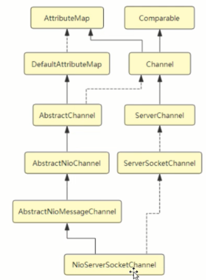

## Netty 高性能的关键


高性能几个点：

* 协议：数据格式，编码格式
* IO 传输通道：
* 线程：Reactor 模型（单线程、多线程、主从多线程）

epoll模型设计思想（boss 线程 管理  N个 worker 线程）


线程池

handleAccept

handleRead


* 异步非阻塞通讯：基于 NIO 的  异步非阻塞通讯框架，加了 线程池

* 零拷贝：利用直接内存

* 内存池 ：ByteBuf，组合Buffer对象

* 无锁化的串行设计理念： pipeline#addlast(handler)
  线程Handler


高效并发编程、

高性能序列化框架：protobuf

* 灵活 TCP 参数：SO_RCVBUF，SO_SNDBUF
  OPTION 参数

单个通道下所有的业务逻辑处理就是有序的，可控的（每一个逻辑就是一个线程）
多通道之间互不干扰，并行


文件传输 transferTo 方法，直接传避免 write 造成的内存拷贝


xxx0 实现类方法，而非接口方法


> * server 端 配置信息
>
> EventLoopGroup （NioEventLoopGroup）
>
> ServerBootstrap#group#
>
> channel(NioServerSocketChannel.class)#        // 类似 IOC 创建 channel
>
> option(ChannelOption.xxxx)#
>
> childhandler( new ChannelInitializer<SocketChannel>(){...})#
>
> childOption
>
>
>
> ServerBootstrap#bind
>
>
>
> * 客户端配置信息
>
> EventLoopGroup （NioEventLoopGroup）
>
> Bootstrap#group#
>
> channel(NioSocketChannel.class)#        // 类似 IOC 创建 channel
>
> option(ChannelOption.xxxx)#
>
> handler( new ChannelInitializer<SocketChannel>(){...})#
>
>
> Bootstrap#connect

ChannelPipeline  添加handler，编码，解码，自定义

## 使用 Netty


手写Tomcat

不同的 handler：

* 实现对 HTTP 协议的解析

  > ```
  > /** 解析 HTTP 请求 */
  > pipeline.addLast(new HttpServerCodec());
  > //主要是将同一个http请求或响应的多个消息对象变成一个 fullHttpRequest完整的消息对象
  > pipeline.addLast(new HttpObjectAggregator(64 * 1024));
  > //主要用于处理大数据流,比如一个1G大小的文件如果你直接传输肯定会撑暴jvm内存的 ,使用该 handler我们就不用考虑这个问题了
  > pipeline.addLast(new ChunkedWriteHandler());
  > // 自定义处理(静态文件加载)
  > pipeline.addLast(new HttpHandler());
  > ```

* 实现对 WebSocket 的解析

  > ```
  > /** 解析 webSocket 请求 */
  > pipeline.addLast(new WebSocketServerProtocolHandler("/im"));
  > // 自定义处理
  > pipeline.addLast(new WebSocketHandler());
  > ```

* 实现对 自定义协议 的解析

  > ```
  > // 解析自定义协议
  > pipeline.addLast(new IMDecoder());
  > pipeline.addLast(new IMEncoder());
  > pipeline.addLast(new SocketHandler());
  > ```


# 源码分析

 channel() 创建后   -> 从底往上研究


## 客户端 Bootstrap

NioSocketChannel   对 SocketChannel 的包装

* ChannelFactory 和 ChannelType


```
channel()  ->ReflectiveChannelFactory#newChannel 


Bootstrap.connect -> 
AbstractBootstrap.doResolveAndConnect -> 
AbstractBootstrap.initAndRegister
(nio-channel 创建  反射构造（无参） -> nio-Provider NIO源码) ->  
doResolveAndConnect0(实现类方法)  -> 
doConnect
-> ..... -> 
ChannelHandlerContext.connect
```

构造函数  -> NIO Provider

#### Channel 初始化

* AbstratChannel#newChannelPipeline()


#### \*Unsafe 类 初始化


#### pipeline 初始化

双向链表  HeadContext，TailContext

HeadContext，TailContext


MultithreadEventLoopGroup#newChild


#### EventLoopGroup（线程池）初始化


#### Channel 注册

>  AbstractBootstrap.initAndRegister   -> 
>
> MultithreadEventLoopGroup.register ->
>
> SingleThreadEventLoopGroup.register  ->  
>
> AbstractChannel$AbstractUnsafe.register
>
> Channel Initializer  只用于配置 （remove(this)），模板模式
>
> fire* 方法
>
> channelRegistered

##  客户端连接分析

doConnect

AbstractChannelHandlerContext#connect


findContextOutbound()  ->  从 DefaultChannelPipeline 内 的 双向链表 的 tail 开始，不断向前寻找第一个 outbound 为 true 的 AbstractChannelHandlerContext，然后调用它的 invokeConnect 方法

NioByteUnsafe -> AbstractNioUnsafe.connect   （关键，正常点击找源码陷入死循环，debug方式）

NioSocketChannel.doConnect

* 执行链路

> NioEventLoop#connect ->  
>
> NioEventLoop#doResolveAndConnect  ->  
>
> NioEventLoop#doResolveAndConnect0  -> 
>
> NioEventLoop#doConnect  ->  
>
> NioSocketChannel#connect -> 
>
> DefaultChannelPipeline#connect  -> 
>
> TailContext#connect ->
>
> HeadContext#connect ->
>
> AbstractNioUnsafe#connect  ->
>
> NioSocketChannel#doConnect ->
>
> SocketChannel#connect

## 服务端 ServerBootstrap



EventLoopGroup

> ServerBootstrap.handler(加权限控制用)

ChannelType

NioServerSocketChannel   


Byte <--> Message


### Channel 和 ChannelPipeline

每个 channel 都有且仅有一个 channelpipeline 与之对应， 多个context/handler

#### 关于 Pipeline 的事件传输机制

参照物 channel

Out  请求型动作 业务程序主动触发

In     响应型动作  Netty来主动触发，业务程序是被动接收（事件）


inbound （接收）        true/false         ChannelInboundHandler
outbound （发送）      false/true        ChannelOutboundHandler

尾进头出

Outbound 事件(请求发生)   tail -> customContext -> head


fireChannelRegistered ->  

环

###  EventLoop


## Promise 和 Future（成对）

Promise    异步调用，可写Future

Future       异步调用

Future#addListener

UI层面


## 各种 Handler

### ChannelHandlerContext

Channel 加入 ChannelPipeline 创建 ChannelHandlerContext

AbstractChannelHandlerContext#firechannelregister()

### Channel 状态（方法）

ChannelUnregistered

ChannelRegistered

ChannelInactive

ChannelActive

## 设计模式

装饰器、责任链模式、模板模式、工厂模式、反应堆


大部分缓冲为堆外内存

MultithreadEventLoopGroup#newChild  -> 

SingleThreadEventLoop#register  ->  

 channel.unsafe().register -> 

AbstractUnsafe.register 中 AbstractChannel.this.eventLoop = eventLoop   -> eventLoop#execute

doStartThread

.

## 拆包和粘包

TCP底层

> 编码     拆包
>
> 解码     粘包

handler.codec 包下 

编解码：base64、protobuf、spdy、JBoss Marshalling


序列化和反序列化


